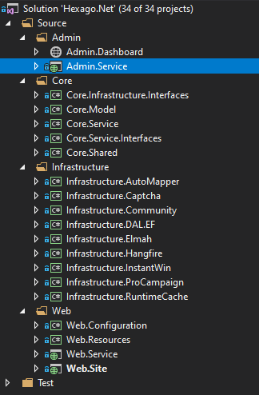

# Swift Template for Visual Studio

Project scaffolding templates for ASP.NET Core, ASP.NET Framework, Umbraco CMS

## 1. Author

Nalijaona Irina Andriamifidy  
@sourcewalker

## 2. About this project

This project is for maintaining the folder structure of the extension for starting new project.  

### 2.1. Prerequisites for using the project

- Microsoft Visual Studio 2019 (recommended)
- .NET Framework 4.7.2
- .NET Core 2.2
- Umbraco 7.14.0

### 2.2. Installation

- By installing the .vsix file

1. Download `v1.0\Swift.vsix`
2. Go to Visual Studio and the "new project" dialog should contains now:
    - `Clean Core by PBIO`
    - `Hexago .NET by PBIO`
    - `Swift Umbraco by PBIO`

    Or

- By Copying files to Template folder

1. Download `v1.0\Clean.Core.zip`, `v1.0\Hexago.Net.zip` and `v1.0\Swift.Umbraco.zip`
2. Navigate to the folder `%USERPROFILE%\Documents\Visual Studio %version%\Templates\ProjectTemplates\`
3. Create subfolders in this location named `CleanCore`, `HexagoNet` and `SwiftUmbraco`
4. Place the previous zip files in each subfolder respectively.
5. Go to Visual Studio and the "new project" dialog should contains now:
    - `Clean Core by PBIO`
    - `Hexago .NET by PBIO`
    - `Swift Umbraco by PBIO`

## 3. Structure

The extension have 3 templates for monolith project generation:
- Clean Core (.NET Core 2.2 based project using either MVC or Angular on presentation)
- Hexago .Net (.NET Framework 4.7.2 based project using MVC on presentation)
- Swfit Umbraco (.NET Framework 4.7.2 based project using Umbraco CMS on presentation)

### 3.1. Clean Core

This Template is as ASP.NET Core web project using .NET Core 2.2 structured as following:  

  
*Fig. 1: Clean Core VS Project Structure*

### 3.2. Hexago .NET

This Template is as ASP.NET Framework web project using .NET Framework 4.7.2 structured as following:  

  
*Fig. 2: Hexago .Net VS Project Structure*

### 3.3. Swift Umbraco

This Template is as ASP.NET Framework web project integrating Umbraco CMS 7.14.0 using .NET Framework 4.7.2 structured as following:  

  
*Fig. 3: Swift Umbraco VS Project Structure*

## 4. Architecture

### 4.1. Clean Core

The architectural overview of the template is resumed as per the following image:

  
*Fig. 4: Clean Core Project Architecture*

### 4.2. Hexago .NET

The architectural overview of the template is resumed as per the following image:

  
*Fig. 5: Hexago .Net Project Architecture*

### 4.3. Swift Umbraco

The architectural overview of the template is resumed as per the following image:

  
*Fig. 6: Swift Umbraco Project Architecture*